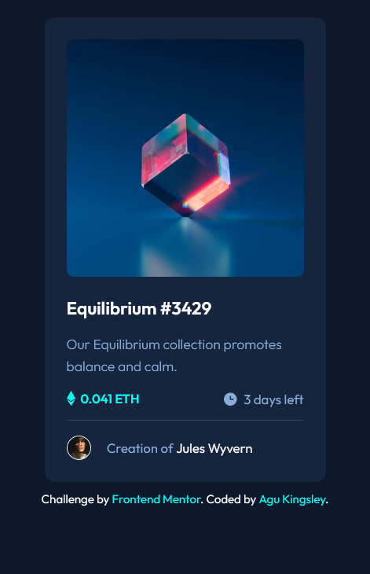

# Frontend Mentor - NFT preview card component solution

This is a solution to the [NFT preview card component challenge on Frontend Mentor](https://www.frontendmentor.io/challenges/nft-preview-card-component-SbdUL_w0U). Frontend Mentor challenges help you improve your coding skills by building realistic projects. 

## Table of contents

- [Overview](#overview)
  - [The challenge](#the-challenge)
  - [Screenshot](#screenshot)
  - [Links](#links)
- [My process](#my-process)
  - [Built with](#built-with)
  - [What I learned](#what-i-learned)
  - [Continued development](#continued-development)
- [Author](#author)

## Overview

### The Challenge

Users should be able to:

- View the optimal layout depending on their device's screen size.
- See hover states for interactive elements.

### Screenshot

#### Desktop Design

#### Mobile Design

### Links

- Live Site URL: [NFT-Card Component Site](https://nft-preview-card-component-kyng.netlify.app/)

## My Process

### Built with

- HTML
- CSS
- SCSS
- Flexbox
- Mobile-first workflow

### What I learned

##### CSS
- I learnt more on **pseudo classes and elements** and how best to apply them for the hover states.
- I learnt about **image overlay effects** with this challenge.
- I learnt more about **CSS positioning**.
- i learnt about the best way to use **svg icons**.

##### Scss
- I learnt how to work with the **.scss** file and how to watch sass live with VS code.
- I learnt Scss features **(nesting selectors, variables, storing maps in variables, usage of ampersand sign, media queries).**
- I learnt about how to retrieve variables within a map with the **map-get function.** 

##### Markdown
- I learnt how to write README.md files for the first time.

### Continued development

These are some of the concepts I need to work on in future projects which needs to be refined:
- Psuedo classes and elements.
- Nested properties in Scss.
- Image overlay effects.

## Author

- Frontend Mentor - [@didyouseekyng](https://www.frontendmentor.io/profile/didyouseekyng)
- Twitter - [@didyouseekyng](https://www.twitter.com/didyouseekyng)

